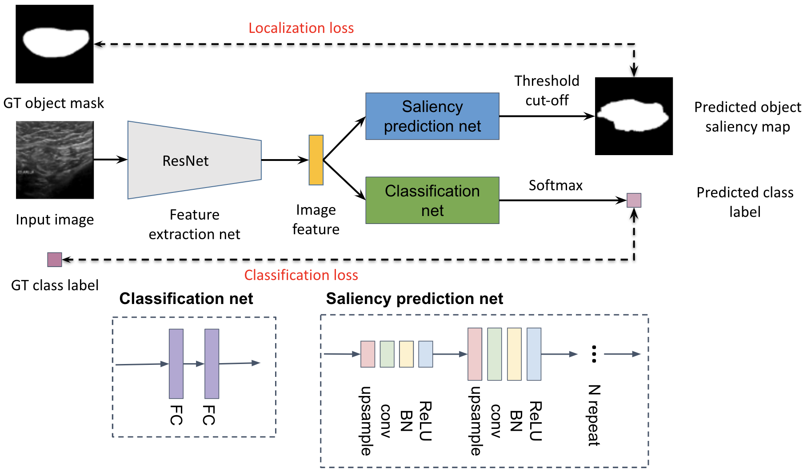
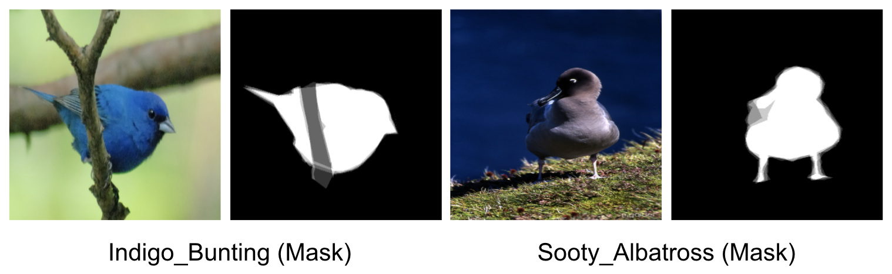
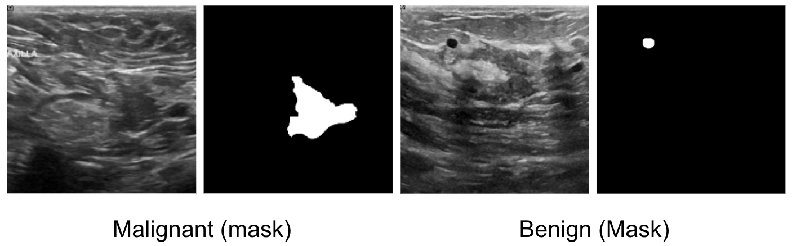
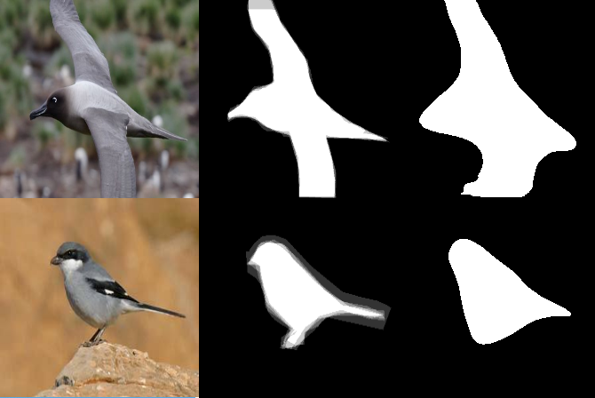
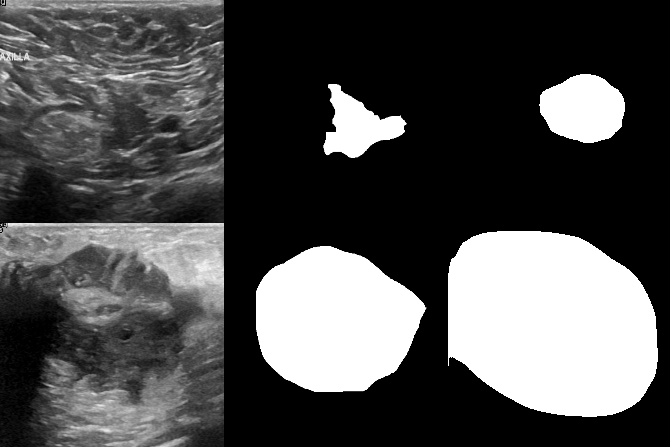

## ECE549 final project: Explainable deep learning-based classification on small datasets
#### 1.Motivation
The common pipeline CNN-based image classification includes the following step: 1) extract the image feature; 2) predict class by the use of extracted feature. These learned features may lose important spatial information of the object. 
One intuitive way to improve the feature for maintaining spatial information of the object is to use the ground-truth localization label to supervise the feature learning process. 

#### 2. Network architecture
A classification network with saliency prediction branch is proposed to extract the informative feature that can be used to reconstruct the object segmented. In this study, the method was proved to be effective even only partial location annotation data is available.



#### 3. Network training
##### 3.1 Training dataset
Two datasets were employed in this study. Both datasets have segmentation mask data as object localization information. 
- [CUB BIRD dataset](http://www.vision.caltech.edu/visipedia/CUB-200.html): images of 8 categories of birds, 003.Sooty_Albatross, 014.Indigo_Bunting, 067.Anna_Hummingbird, 102.Western_Wood_Pewee, 112.Great_Grey_Shrike, 122.Harris_Sparrow, 188.Pileated_Woodpecker, 194.Cactus_Wren, were chosen with 382 images as training set, 48 images as validation and testing set, respectively.

- [BUSI breast tumor ultrasound dataset](https://scholar.cu.edu.eg/?q=afahmy/pages/dataset): images of 2 kinds of breast tumors, benign or malignant, were used with 368 images as training set and 46 images as validation set and testing set respectively.


##### 3.2 Training command
Here is an example to train the network. 
```bash
python train.py --feat_name="resnet18"    \ # feature extraction network, eg: resnet18, resnet34, resnet50, ... 
                --mask_name="mask_rasaee" \ # localization prediction network, eg: mask_rasaee, mask_attention2, ...
                --mask_loss="CE"          \ # loss function to supervise localization network training, eg: l1, l2, CE, ...
                --num_mask_blocks=4       \ # number of upsampling blocks used in localization network, 3 or 4
                --partial_label=True      \ # use fully supervised training or semi-supervised training for localization network
                --image_size=224          \ # input image size
                --dataset="BUSI"          \ # dataset name
                --num_classes=2           \ # number of classes in given dataset
                --batch_size=16           \ # batch size
                --num_epochs=40           \ # number of epochs
                --model_save_path="test"  \ # path to save trained model
                --pretrained_weights=None \ # path of pretrained weights
                --lr=0.0001               \ # init learning rate
                --moment=0.9              \ # learning rate decay moment
                --use_pretrained=True     \ # load pretrained weights for feature extraction network or not 
                --device="cuda:0"         \ # use gpu or not. If not, set 'cpu'
                --num_gpus=1              \ # number of gpus used for training
                --dilute_mask=0           \ # dilute mask with given thichness
                --mask_weight=1.0         \ # weighting factor of localization loss to be combined with classification loss.
```
Also, adjust setting in `run_train.sh` and run it via `bash run_train.sh`

#### 4. Evaluating trained model
4 metrics were computed in the study to represent model classification performance, precision, sensitivity, specificity, and F1-score. 
```bash
python eval.py --feat_name="resnet18"      \
               --mask_name="mark_rasaee"   \
               --num_blocks=4              \
               --return_mask=False         \ # Include mask as model output or not
               --dataset="BUSI"            \
               --num_classes=2             \
               --model_weights="test/best_model.pt" \ # path to the model weight file for evaluation. 
               --image_size=224            \
               --device="cuda:0"           \
               --multi_gpu=False           \ # use multiple gpu during training or not
               accuracy
```
Modify `run_eval.sh` for testing.

#### 5. Predicting the object location
Visualize the object mask predicted by the localization network. 
```bash
python eval.py --feat_name="resnet18"    \
               --mask_name="mask_rasaee" \
               --num_blocks=4   \
               --dataset="BUSI" \
               --num_classes=2  \
               --model_weights="test/best_model.pt" \
               --image_size=224  \
               --device="cuda:0" \
               --multi_gpu=False \
               --return_mask=True\
                  image2mask     \
               --seg_image_list="test/draw_busi.txt" \ # file containing list of image paths for predicting the masks 
               --mask_save_file="test/busi_mask.png"   # path to save the predicted mask image
```
Modify `run_vis_loc.sh` for visualizing segmented object masks. 

As shown in the following images, the left column is original images, the middle column is GT masks, the right column is the predicted masks. 



#### 6. Visualizing model saliency map
We employed Grad-CAM to visualize the saliency map with this [repository](https://github.com/jacobgil/pytorch-grad-cam).
```bash
python eval.py  --feat_name="resnet18"\
                --mask_name="mask_rasaee" \
                --num_blocks=4 \
                --dataset="BUSI" \
                --num_classes=2 \
                --model_weights="test/best_model.pt" \
                --image_size=224 \
                --device="cuda:0" \
                --multi_gpu=False \
                --return_mask=True \
                    saliency \
                --image_path="/home/zongfan2/Documents/ECE549_project/CUB_200_2011/CUB_200_2011/images/067.Anna_Hummingbird/Anna_Hummingbird_0037_56587.jpg" \       # image path to visualize
                --saliency_file="test/busi_saliency.png" # path to save the saliency image
```
Modify `run_saliency` for visualizing the saliency map. 

#### 7. License
[](https://opensource.org/licenses/MIT)
This project follows the MIT license.
